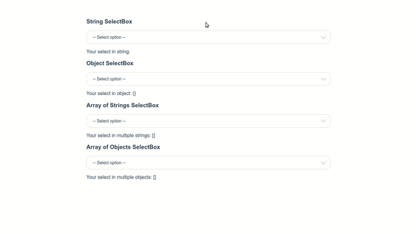
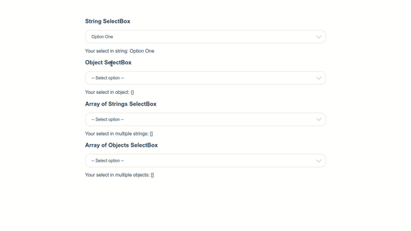
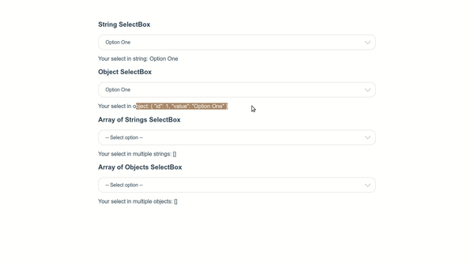
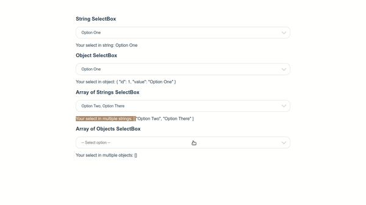

# Tedir Select
Tedir Select is a Vue 3 Custom SelectBox, ListBox, Taggable, etc.

#### Select box in string type

#### Select box in object type

#### Select box in array of strings

#### Select box in array of objects

