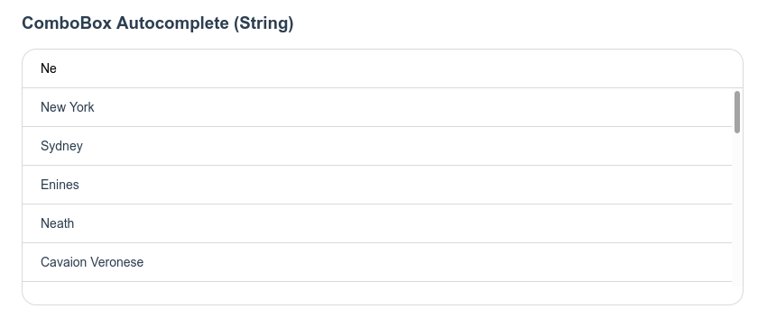
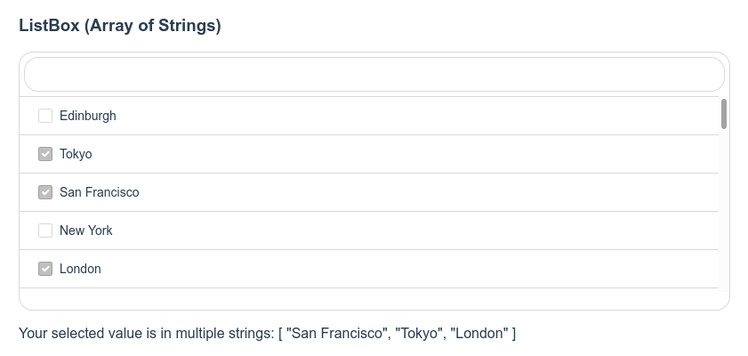

# Tedir Select
Tedir Select is a Custom SelectBox, Multiple ListBox, ComboBox Autocomplete, and Tags Input for Vue 3 and Web Components

## Install & Usage
```bash
npm install tedir-select

or

yarn add tedir-select
```
Initialize it in the .vue file
```html
<script setup>
import { ref, reactive } from 'vue'
import { SelectBox, ComboBox, ListBox, TagBox, CategoryBox } from 'tedir-select'

const stateRef = ref('')
const options = reactive(['Option One', 'Option Two', 'Option Three'])
</script>

<template>
  <SelectBox v-model="stateRef" :options="options" placeholder="-- Select Option --" :size="5" />
</template>
```

#### Select box in string type


#### Select box in object type


#### Select box in array of strings


#### Select box in array of objects


#### Combo box autocomplete in string and object


#### List box in string, object, array of strings and array of objects

